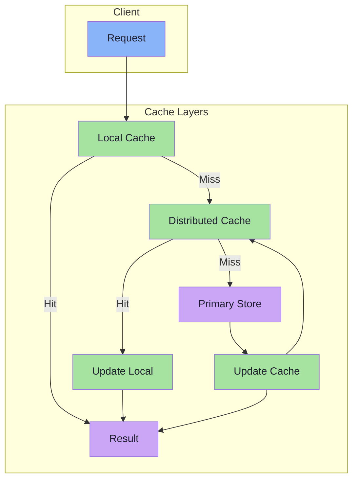

```mermaid
graph TB
    subgraph Client
        R[Request]
    end

    subgraph "Cache Layers"
        LC[Local Cache]
        DC[Distributed Cache]
        PS[Primary Store]
        UC[Update Cache]
        RR[Result]
        UL[Update Local]
    end

    R --> LC
    LC -- Miss --> DC
    DC -- Miss --> PS
    PS --> UC
    UC --> DC
    LC -- Hit --> RR
    DC -- Hit --> UL
    UL --> RR
    UC --> RR

    classDef client fill:#89b4fa,color:#1e1e2e
    classDef cache fill:#a6e3a1,color:#1e1e2e
    classDef store fill:#cba6f7,color:#1e1e2e
    classDef result fill:#cba6f7,color:#1e1e2e

    class R client
    class LC,DC,UL,UC cache
    class PS store
    class RR result
```