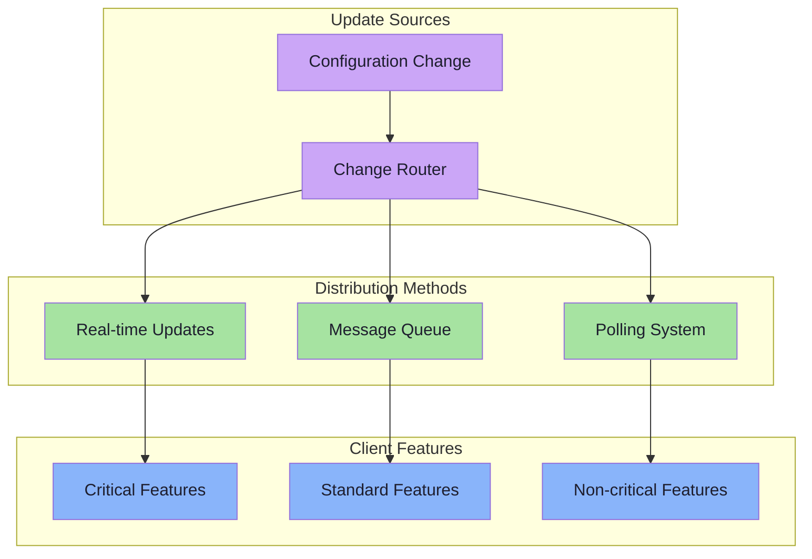

```mermaid
graph TD
    subgraph "Update Sources"
        A[Configuration Change] --> B[Change Router]
    end

    subgraph "Distribution Methods"
        B --> C[Real-time Updates]
        B --> D[Message Queue]
        B --> E[Polling System]
    end

    subgraph "Client Features"
        C --> F[Critical Features]
        D --> G[Standard Features]
        E --> H[Non-critical Features]
    end

    classDef source fill:#cba6f7,color:#1e1e2e
    classDef method fill:#a6e3a1,color:#1e1e2e
    classDef client fill:#89b4fa,color:#1e1e2e

    class A,B source
    class C,D,E method
    class F,G,H client
```