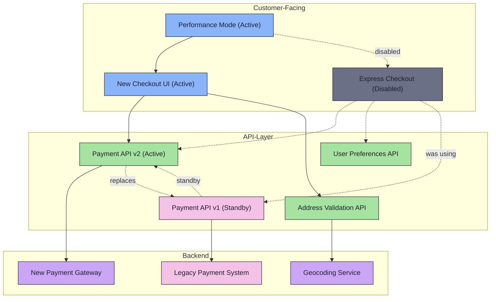

```mermaid
graph TD
    subgraph Customer-Facing
        A["New Checkout UI (Active)"]
        F["Express Checkout (Disabled)"]
        H["Performance Mode (Active)"]
    end

    subgraph API-Layer
        B["Payment API v2 (Active)"]
        J["Payment API v1 (Standby)"]
        C["Address Validation API"]
        G["User Preferences API"]
    end

    subgraph Backend
        D["New Payment Gateway"]
        E["Geocoding Service"]
        I["Legacy Payment System"]
    end

    %% Core to API Dependencies
    A --> B
    A --> C
    F -.-> B
    F -.-> G

    %% Legacy Dependencies
    F -. was using .-> J
    J --> I

    %% API to Service Dependencies
    B --> D
    C --> E

    %% Performance Mode Dependencies and Conflicts
    H --> A
    H -. disabled .-> F

    %% Migration Conflicts
    B -. replaces .-> J
    J -. standby .-> B

    %% Styling
    classDef core fill:#89b4fa,color:#1e1e2e,stroke:#1e1e2e
    classDef api fill:#a6e3a1,color:#1e1e2e,stroke:#1e1e2e
    classDef backend fill:#cba6f7,color:#1e1e2e,stroke:#1e1e2e
    classDef conflict fill:#f38ba8,color:#1e1e2e,stroke:#1e1e2e
    classDef legacy fill:#f5c2e7,color:#1e1e2e,stroke:#1e1e2e
    classDef inactive fill:#6c7086,color:#1e1e2e,stroke:#1e1e2e

    class A,H core
    class B,C,G api
    class D,E backend
    class F inactive
    class I,J legacy
```