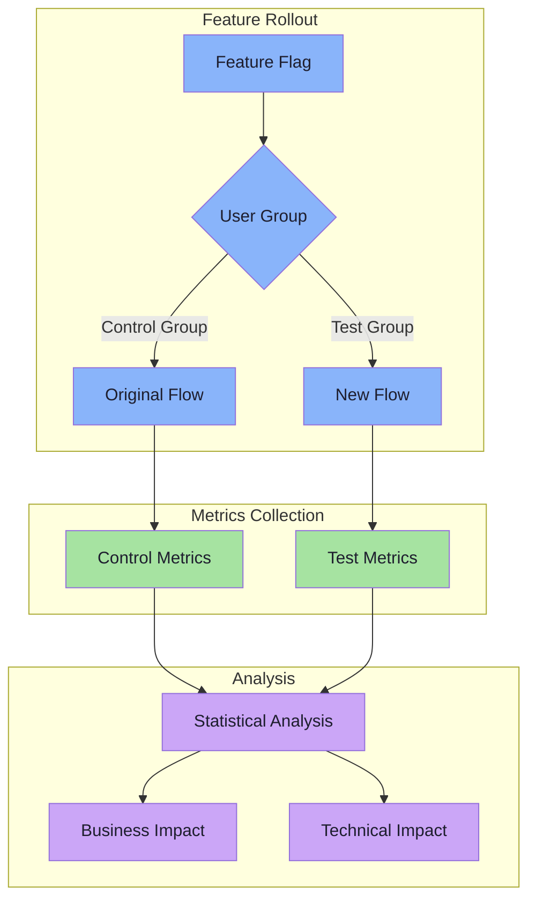

```mermaid
graph TD
    subgraph "Feature Rollout"
        A[Feature Flag] --> B{User Group}
        B -->|Control Group| C[Original Flow]
        B -->|Test Group| D[New Flow]
    end

    subgraph "Metrics Collection"
        C --> E[Control Metrics]
        D --> F[Test Metrics]
    end

    subgraph "Analysis"
        E --> G[Statistical Analysis]
        F --> G
        G --> H[Business Impact]
        G --> I[Technical Impact]
    end

    classDef rollout fill:#89b4fa,color:#1e1e2e
    classDef metrics fill:#a6e3a1,color:#1e1e2e
    classDef analysis fill:#cba6f7,color:#1e1e2e

    class A,B,C,D rollout
    class E,F metrics
    class G,H,I analysis
```